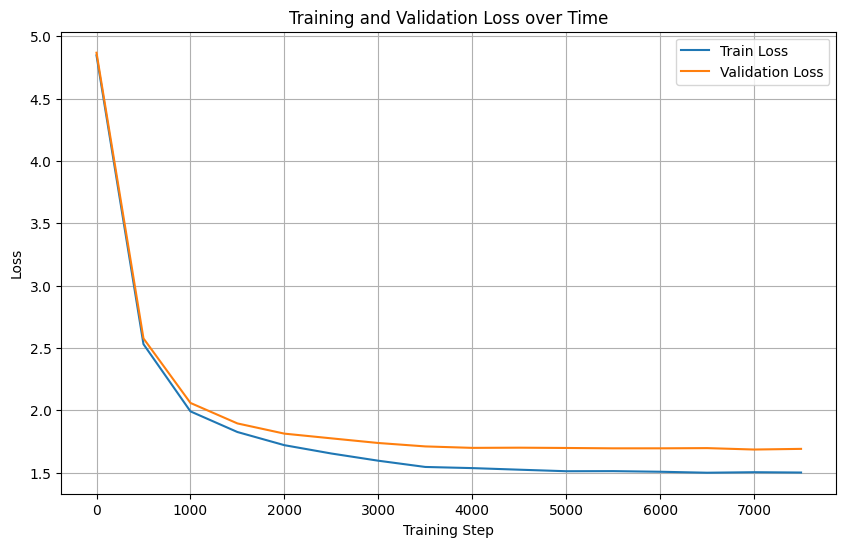

# 🎭 KobiGPT — Rabindranath Tagore Poem Generator

KobiGPT is a **character-level GPT language model** trained exclusively on the complete collection of **Rabindranath Tagore’s Bengali poems**.  
It generates new verses that stylistically and linguistically resemble Tagore’s original poetic rhythm, word patterns, and emotional tone.

---

## 🧠 Model Overview

KobiGPT is based on a **GPT (Generative Pretrained Transformer)** architecture — a type of **decoder-only transformer** that predicts the next character in a sequence given the previous ones. Autoregressive modeling allows it to generate coherent text one character at a time.

- **Type:** Character-level GPT  
- **Architecture:** Decoder-only Transformer (like GPT-2 but smaller)  
- **Framework:** PyTorch  
- **Dataset:** Complete collection of Rabindranath Tagore’s Bengali poems  
- **Tokenizer:** Character-level (139 unique characters)  
- **Training Device:** NVIDIA T4 GPU (Google Colab Free Tier)

---

## ⚙️ Model Configuration

| **Parameter** | **Description / Value** |
|----------------|--------------------------|
| **Context Length (`block_size`)** | 256 characters |
| **Vocabulary Size (`vocab_size`)** | 139 unique characters |
| **Transformer Layers (`n_layer`)** | 6 |
| **Attention Heads (`n_head`)** | 8 |
| **Embedding Dimension (`n_embd`)** | 512 |
| **Dropout** | 0.2 |
| **Use Bias** | ✅ True |
| **Total Parameters** | ≈ **19.18 million** |
| **Optimizer** | AdamW |
| **Initial Learning Rate** | 3 × 10⁻⁴ |
| **LR Schedule** | Decayed by ×0.1 at steps **3000** and **5000** |
| **Batch Size** | 32 |
| **Training Steps** | 8000 |
| **Training Duration** | ~1.5 hours |
| **Hardware** | NVIDIA T4 GPU (Google Colab Free Tier) |


---

## 🔍 Model Architecture Explained

### 🔸 Embedding Layer
Each character is mapped to a **512-dimensional vector** via a learnable embedding matrix.  
Positional embeddings are added to retain sequence order.

### 🔸 Transformer Blocks
The model consists of **6 layers**, each with:
- Masked multi-head self-attention (8 heads)
- Feed-forward projection (2-layer MLP)
- Layer normalization and residual connections

### 🔸 Output Projection
The final layer projects the hidden representation back into the vocabulary space, producing logits for each character.


---

## 🧩 Forward Pass (Intuitive Overview)

1. Input sequence (e.g., `"\n"`) is encoded into character IDs.  
2. Each ID is converted into embeddings and combined with positional encodings.  
3. The transformer layers use **self-attention** to model dependencies between all characters.  
4. The model predicts the next character probability distribution.  
5. Loss is computed via **cross-entropy**.


---

## 📈 Training Curve (Loss Progression)

| Metric | Value |
|---------|--------|
| Final Train Loss | 1.50 |
| Final Val Loss | 1.69 |
| Training Steps | 8000 |
| GPU Time | ~1.5 hours |

<p align="center">
  
</p>

The final validation loss of **~1.69 nats (≈2.44 bits per character)** indicates strong character-level modeling capability for a small GPT trained on poetic text.

---

## 🪶 Sample Generated Poem

From a generation run without any prompt (starting from `"\n"`):
```
হাসি ছুটি তাে গান গেয়ে,
তারে এঁকে দেবে হেসে।
এ ভুবনচরণ তৃষা এসে বেদনা,
তরুণ হৃদয় উঠে শ্যামা মেঘের ফুল
ওই যেন আলো
ঝাউয়ের'পরে পড়ে আজ।
আকাশ ছিঁড়ে নাইল চোখে।
স্নেহমুখীর ছড়ায়ে নাই, চমকি
চূর্ণ ছড়িয়া চলে যায়,
তার কপোলে তার বালে দেখী,
বাঁধন কেঁদে উড়ে যায়।
হৃদয় কুসুম সাগরে
মিশে কে জানিল না কখনো,
চেয়ে না এসে না বেশি বেশি বেদে।
বসন্ত যবে কালবৈশাখে,
ডালি পাছে ঝরিয়া গাঁথিতে খুঁজে,
ফুল যে পাছে ফুটে ফুটে,
তারি সুর পথে পাতা পাতা তফুটে।
হাসিমুখে মেঘের কোণে
রয়েছে চিরদিন
ব্যাপিয়া মধু,
প্রভাতসংগীত
ভালোবাসিল আকাশ-কুমল।
```

With a custom prompt: `"বিনয় ভাবছে আকাশ কেন নীল,"`

```
বিনয় ভাবছে আকাশ কেন নীল,
ভবিষ্যৎ মাঞ্চিতের হানল;
আমাদের মন্ত্র দেখছি বিস্ময়ের ক্রন্দনে
আমাকে এসেছি আমার দলে, কেবল সিহাস করে।
বিশ্বাস-বীরে কল্পনা...
```
⚠️ Note: Since the model was trained exclusively on Tagore’s poems, it may not mention modern names like “বিনয়” unless they appear in the prompt. To guide the model, you can repeat your name in the prompt or use a leading token like "বিনয়:".

> While writing prompt avoid using characters outside the known vocabulary to prevent unknown token issues. Unknown characters are currently mapped to space (' ').

---

## 🧩 Usage

### 🔹 Inference

You can generate text using:

```bash
python src/generate.py
```

You can adjust **max_new_tokens** and **temperature** in `src/generate.py` to control generation length and creativity.

---

### 🧾 How to Train

```bash
python src/train.py
```

Tweak hyperparameters in `src/train.py` as needed.

---

## 📜 Acknowledgements

- Inspired by Andrej Karpathy’s nanoGPT implementation.

- Trained and fine-tuned on Rabindranath Tagore’s Bengali poem corpus.

- Dataset: Public domain Bengali poems by Rabindranath Tagore, available on Kaggle.  

- Developed and trained by **Binoy Bhushan Barman Dipu** as part of learning and experimentation with GPT architectures.

---

## 💡 Future Work

- Implement BPE or WordPiece tokenization for better semantic coherence.

- Experiment with larger context lengths (512+) and deeper models.

- Add Bangla rhyme and meter control for stylistic conditioning.

- Integrate UI-based poem generator using Streamlit or Flask.


> “KobiGPT is not just a model — it’s a poetic mirror where Tagore’s spirit of words finds a neural echo.”